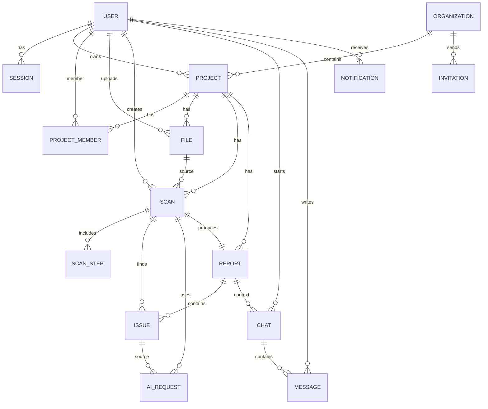

# Архитектура базы данных проекта "Ревьюша"

## 1. Назначение документа

Этот документ описывает структуру базы данных проекта:

- основные сущности;
- связи между сущностями;
- правила хранения данных;
- индексы;
- ограничения;
- принципы работы с Prisma.

Основная СУБД:

```
PostgreSQL
```

ORM:

```
Prisma
```

---

# 2. Общие принципы хранения данных

## 2.1 PostgreSQL является источником истины

Все критические данные системы хранятся в PostgreSQL.

Примеры:

- пользователи;
- проекты;
- анализы;
- отчёты;
- замечания;
- настройки.

---

## 2.2 Файлы не хранятся в PostgreSQL

Исходный код проектов и архивы хранятся в MinIO.

В PostgreSQL сохраняются только:

- идентификатор файла;
- имя;
- размер;
- тип;
- путь в MinIO;
- связь с проектом.

---

## 2.3 Все изменения проходят через Prisma Migration

Изменение структуры БД выполняется только через миграции.

Запрещено:

- ручное изменение таблиц в production;
- прямые SQL изменения без миграции.

---

# 3. Основные сущности

Основные таблицы:

```
User

Role

Session

Project

ProjectMember

File

Scan

ScanStep

Report

Issue

AIRequest

Chat

Message

Organization

Invitation

Notification
```

---

# 4. User

Пользователь системы.

Используется для:

- авторизации;
- владельца проектов;
- командной работы.

Сущность:

```
User
```

Поля:

```
id

email

passwordHash

name

avatar

createdAt

updatedAt
```

Связи:

```
User

1 ---- N

Project
```

```
User

1 ---- N

Session
```

```
User

N ---- N

Organization
```

---

# 5. Session

Хранение пользовательских сессий.

Используется для:

- refresh token;
- управления активными входами.

Поля:

```
id

userId

refreshTokenHash

device

ip

expiresAt

createdAt
```

Связь:

```
User

1 ---- N

Session
```

---

# 6. Project

Главная сущность продукта.

Проект пользователя, который анализируется системой.

Поля:

```
id

ownerId

name

description

language

status

createdAt

updatedAt
```

Примеры:

```
React Portfolio

Python Bot

NestJS API
```

Связи:

```
User

1 ---- N

Project
```

```
Project

1 ---- N

File
```

```
Project

1 ---- N

Scan
```

---

# 7. ProjectMember

Подготовка под Team тариф.

Позволяет нескольким пользователям работать с одним проектом.

Поля:

```
id

projectId

userId

role

createdAt
```

Роли:

```
OWNER

EDITOR

VIEWER
```

Связи:

```
Project

1 ---- N

ProjectMember

N ---- 1

User
```

---

# 8. File

Метаданные файлов проекта.

Сами файлы находятся в MinIO.

Поля:

```
id

projectId

filename

storagePath

mimeType

size

hash

createdAt
```

Пример:

```
src/main.ts

src/auth/service.ts

package.json
```

Связь:

```
Project

1 ---- N

File
```

---

# 9. Scan

Один запуск анализа проекта.

Например:

Пользователь загрузил новую версию проекта.

Создаётся новый Scan.

Поля:

```
id

projectId

status

startedAt

completedAt

createdAt
```

Статусы:

```
CREATED

QUEUED

PROCESSING

COMPLETED

FAILED
```

Связь:

```
Project

1 ---- N

Scan
```

---

# 10. ScanStep

Этапы выполнения анализа.

Используется для отображения прогресса.

Поля:

```
id

scanId

type

status

startedAt

completedAt
```

Типы:

```
UPLOAD

EXTRACT

PARSE

ANALYZE

REPORT
```

Связь:

```
Scan

1 ---- N

ScanStep
```

---

# 11. Report

Итоговый результат анализа.

Поля:

```
id

scanId

summary

score

filePath

createdAt
```

Хранит:

- общий вывод;
- оценку качества;
- ссылку на экспорт.

Связь:

```
Scan

1 ---- 1

Report
```

---

# 12. Issue

Отдельное замечание AI.

Пример:

```
SQL injection risk

Плохая обработка ошибок

Нарушение SOLID
```

Поля:

```
id

reportId

fileId

title

description

severity

lineStart

lineEnd

suggestion

createdAt
```

Уровни:

```
CRITICAL

HIGH

MEDIUM

LOW

INFO
```

Связи:

```
Report

1 ---- N

Issue
```

```
File

1 ---- N

Issue
```

---

# 13. AIRequest

История запросов к LLM.

Нужна для:

- аналитики;
- контроля расходов;
- отладки.

Поля:

```
id

scanId

model

tokensInput

tokensOutput

cost

status

createdAt
```

Связь:

```
Scan

1 ---- N

AIRequest
```

---

# 14. Chat

Чат пользователя с AI по результатам анализа.

Поля:

```
id

userId

projectId

createdAt
```

Связи:

```
User

1 ---- N

Chat
```

```
Project

1 ---- N

Chat
```

---

# 15. Message

Сообщение в AI чате.

Поля:

```
id

chatId

role

content

createdAt
```

Роли:

```
USER

ASSISTANT
```

Связь:

```
Chat

1 ---- N

Message
```

---

# 16. Organization

Командная сущность.

Поддержка:

- Team;
- Enterprise.

Поля:

```
id

name

ownerId

createdAt
```

---

# 17. Invitation

Приглашения пользователей.

Поля:

```
id

organizationId

email

role

status

expiresAt
```

---

# 18. Notification

Уведомления.

Поля:

```
id

userId

type

message

read

createdAt
```

Примеры:

```
ANALYSIS_COMPLETE

ANALYSIS_FAILED

INVITATION_RECEIVED
```

---

# 19. Основные связи

Общая схема:

```
User

 |
 |
 +---- Project

          |
          |
          +---- File

          |
          |
          +---- Scan

                    |
                    |
                    +---- ScanStep

                    |
                    |
                    +---- Report

                              |
                              |
                              +---- Issue


Project

 |
 |
 +---- Chat

          |
          |
          +---- Message
```

---

# 20. Индексы

Обязательные индексы:

## User

```
email UNIQUE
```

---

## Project

```
ownerId

createdAt
```

---

## Scan

```
projectId

status

createdAt
```

---

## Issue

```
reportId

severity

fileId
```

---

# 21. Удаление данных

Используется мягкое удаление для важных сущностей.

Например:

```
deletedAt
```

Применяется к:

- User;
- Project;
- Organization.

---

# 22. Будущие расширения

Структура БД должна позволять добавить:

- GitRepository;
- PullRequest;
- Commit;
- CodeReview;
- Billing;
- Subscription;
- API Keys;
- Webhooks.

---

# 23. Итог

База данных "Ревьюши" строится вокруг основных сущностей:

```
User

↓

Project

↓

Scan

↓

Report

↓

Issue
```

Эта цепочка является основным бизнес-процессом продукта:

Пользователь → Проект → Анализ → Отчёт → Замечания.

Все остальные сущности поддерживают этот процесс.

# 24. ER Diagram и связи для реализации

Файл диаграммы:

```txt
architecture/diagrams/database.drawio
```

---

## 24.1. Основные таблицы MVP

```txt
User
Session
Organization
Project
ProjectMember
File
Scan
ScanStep
Report
Issue
AIRequest
Chat
Message
Notification
Invitation
```

---

## 24.2. Cardinality

```txt
User 1 ── N Session
User 1 ── N Project            через Project.ownerId
User N ── M Project            через ProjectMember
User 1 ── N Chat
User 1 ── N Message
User 1 ── N Notification

Organization 1 ── N Project
Organization 1 ── N Invitation

Project 1 ── N File
Project 1 ── N Scan
Project 1 ── N ProjectMember

File 1 ── N Scan               scan.sourceFileId

Scan 1 ── 1 Report
Scan 1 ── N ScanStep
Scan 1 ── N Issue
Scan 1 ── N AIRequest

Report 1 ── N Issue
Report 1 ── N Chat

Chat 1 ── N Message
```

---

## 24.3. Foreign Keys

```txt
Session.userId          → User.id
Project.ownerId         → User.id
Project.organizationId  → Organization.id nullable
ProjectMember.userId    → User.id
ProjectMember.projectId → Project.id
File.projectId          → Project.id
File.uploadedById       → User.id
Scan.projectId          → Project.id
Scan.sourceFileId       → File.id nullable
Scan.createdById        → User.id
ScanStep.scanId         → Scan.id
Report.scanId           → Scan.id unique
Report.projectId        → Project.id
Issue.scanId            → Scan.id
Issue.reportId          → Report.id nullable
AIRequest.scanId        → Scan.id
AIRequest.issueId       → Issue.id nullable
Chat.reportId           → Report.id
Chat.userId             → User.id
Message.chatId          → Chat.id
Message.userId          → User.id nullable for assistant messages
Notification.userId     → User.id
Invitation.organizationId → Organization.id
Invitation.invitedById  → User.id
```

---

## 24.4. Delete policy

MVP использует soft delete для пользовательских сущностей.

```txt
User.deletedAt
Project.deletedAt
File.deletedAt
Scan.deletedAt
Report.deletedAt
```

Физическое удаление объектов MinIO выполняется отдельной фоновой задачей.

Правила:

- удаление Project помечает Project.deletedAt;
- связанные File/Scan/Report скрываются из обычных запросов;
- MinIO объекты добавляются в очередь cleanup;
- Audit/AIRequest не удаляются сразу, чтобы сохранить биллинг и диагностику.

---

## 24.5. Enum значения

```txt
UserRole: USER, ADMIN, SUPER_ADMIN
ProjectRole: OWNER, MAINTAINER, VIEWER
ScanStatus: CREATED, QUEUED, EXTRACTING, PARSING, ANALYZING, AGGREGATING, REPORTING, COMPLETED, FAILED, CANCELLED
ScanStepStatus: PENDING, RUNNING, COMPLETED, FAILED, SKIPPED
IssueSeverity: INFO, LOW, MEDIUM, HIGH, CRITICAL
IssueCategory: ARCHITECTURE, BUG, SECURITY, PERFORMANCE, STYLE, MAINTAINABILITY, TESTING
IssueStatus: OPEN, RESOLVED, IGNORED
ReportFormat: MD, PDF, JSON
AIRequestStatus: CREATED, SENT, COMPLETED, FAILED
MessageRole: USER, ASSISTANT, SYSTEM
NotificationType: SCAN_COMPLETED, SCAN_FAILED, REPORT_READY, SYSTEM
```

---

## 24.6. Практическая ER-схема



---

# 25. Реализация Prisma Schema Stage 3.1

Статус реализации: ✅ COMPLETE.

Фактическая Prisma-схема находится в:

```txt
apps/api/prisma/schema.prisma
```

Первая миграция:

```txt
apps/api/prisma/migrations/20260801115902_init_schema/migration.sql
```

Seed:

```txt
apps/api/prisma/seed.ts
```

## 25.1. Соответствие ER-сущностям

| Архитектурная сущность | Prisma model       | Таблица PostgreSQL  |
| ---------------------- | ------------------ | ------------------- |
| User                   | `User`             | `users`             |
| Session                | `Session`          | `sessions`          |
| Organization           | `Organization`     | `organizations`     |
| Project                | `Project`          | `projects`          |
| ProjectMember          | `ProjectMember`    | `project_members`   |
| File                   | `UploadedFile`     | `uploaded_files`    |
| Scan                   | `Scan`             | `scans`             |
| ScanStep               | `ScanStep`         | `scan_steps`        |
| Report                 | `Report`           | `reports`           |
| Issue                  | `Finding`          | `findings`          |
| AIRequest              | `AIRequest`        | `ai_requests`       |
| Chat                   | `ChatSession`      | `chat_sessions`     |
| Message                | `ChatMessage`      | `chat_messages`     |
| Notification           | `Notification`     | `notifications`     |
| Invitation             | `Invitation`       | `invitations`       |
| BullMQ Job Journal     | `QueueJob`         | `queue_jobs`        |
| Refresh Token Store    | `RefreshToken`     | `refresh_tokens`    |

`UploadedFile`, `Finding`, `ChatSession` и `ChatMessage` используют более точные имена в коде, чтобы не конфликтовать с глобальными browser/Node naming conventions и явно отражать назначение модели.

## 25.2. Дополнительные технические таблицы

`QueueJob` хранит журнал выполнения задач BullMQ и связывает job с `Project` и `Scan`, когда это применимо.

`RefreshToken` дополняет `Session`: `Session` хранит контекст активного входа, а `RefreshToken` используется как отдельное хранилище token hashes для будущей auth-логики и поддержки нескольких устройств.

## 25.3. Проверки Stage 3.1

Автоматическая приёмка выполняется командой:

```bash
yarn test:stage3
```

Проверяются:

- `prisma validate`;
- `prisma format`;
- `prisma generate`;
- наличие первой migration;
- применение migration к пустой PostgreSQL DB;
- idempotent seed;
- Prisma Client connection;
- CRUD для `User`.
